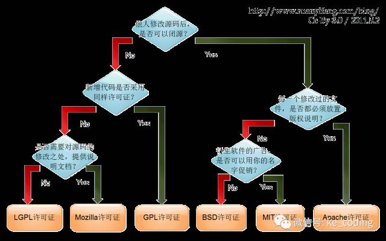

# 如何发起高质量github开源项目

## 创建项目

## 相关开发栈的包管理工具

## README文档

1. 项目简洁的介绍或 slogan
1. 可供访问的演示地址
1. 简单的上手文档
   - 如何通过包管理器等方式获取
   - 如何如何引用
   - 如何调用
   - 如果项目的 API 只有简单几个，文档可以直接写在 README
1. 开源协议
1. 版本变更日志
1. 贡献指南

<a src="itms-services://?action=download-manifest&url=https://ep.watsons.com.cn/download/epios/manifest.plist">苹果下载</a>

## 开源License选择

_参考下图_

